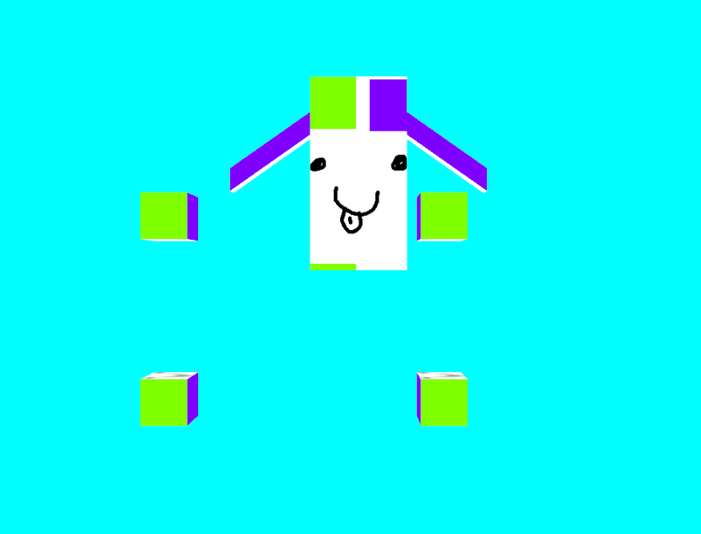

# PoorWand

Basic modular game engine still in development. Win32 version.

## Frameworks & dependencies
- OpenGL 3.3+
- GLEW
- GLFW 3
- GLM (math)
- SOIL 2

## Screenshot - Proof of concept (Still missing a texture manager)

## NOTE for file converter from Collada to custom format
Have to delete the xlmns decalaration of the Collada file, since it breaks the node xml parser

## Custom Model File format

joint        => j (joint matrice 4x4) [parent]

joint group  => g [vector2(joint index, weight)] ... #Total weight must be 1 per group

vertex       => v (vector coords vec3) [g joint group index]

normal       => n [vector3(x, y, z)]

texture(UV)  => u [vector2(s, t)]

#color        => c [vector3 rbg]

face (tri)   => f [format: vertex/normal/texture [/color]]; 

:

j mat4

j mat4 0

j mat4 1

j mat4 1

g vec2jw vec2jw vec2jw

g vec2jw vec2jw vec2jw

v vec3 g

v vec3 g

v vec3 g

n vec3

n vec3

u vec2

u vec2

#c vec3

#f v/n/u/c v/n/u/c v/n/u/c

#f v/n/u/c v/n/u/c v/n/u/c

f v/n/u v/n/u v/n/u

f v/n/u v/n/u v/n/u
